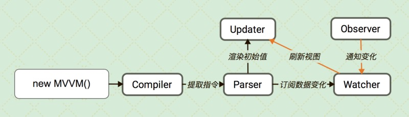
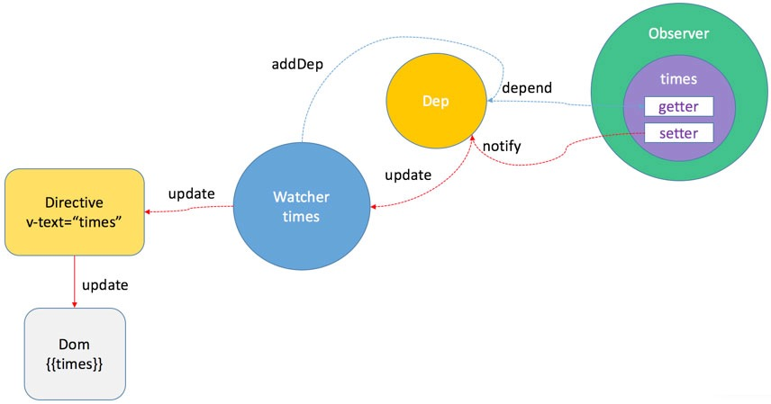

# 如何实现一个MVVM

## 样本


## DEMO

```javascript
import MVVM from './src/core'

const data = {
    a: 1
}

const template = `
    <div>
        <input bind:value="a" on:input="onInput"/>
        <div>{{a}}</div>
    </div>
`

const mv = new MVVM({
    selector: 'body',
    data,
    methods: {
        onInput(e) {
            this.a = e.target.value
        }
    },
    template
})

mv.$watch('a', (newValue) => {
    console.log('callback', newValue)
})

console.log(data.a, mv.a)
data.a = 2
console.log(data.a, mv.a)

global.data = data
```


## 结构





## 结构

- Observer
- Watcher
- Compiler
- Parser


##  详细

### Observer

数据监听器


#### dep

管理订阅队列

```javascript
export default class Dep {
    static target = null

    constructor() {
        this.watchers = []
    }

    addWatcher(watcher) {
        this.watchers.push(watcher)
    }

    notify() {
        this.watchers.forEach(watcher => {
            watcher.update()
        })
    }
}
```

#### observe

拦截数据属性的setter和getter，通过getter将订阅者添加至队列，而setter触发时更新队列。

```js
import Dep from './dep'

export default function observe(data) {
    if (!data || typeof data !== 'object') {
        return
    }
    Object.keys(data).forEach(key => {
        defineReactive(data, key, data[key])
    })
}

function defineReactive(data, key, value) {
    let dep = new Dep()

    observe(value)
    Object.defineProperty(data, key, {
        enumerable: true,
        configurable: true,
        get() {
            let target = Dep.target
            if (target) {
                dep.addWatcher(target)
            }
            return value
        },
        set(newValue) {
            if (newValue === value) {
                return
            }
            value = newValue
            observe(newValue)
            dep.notify()
        }
    })
}
```


### Watcher

根据传入的属性表达式订阅getter，并将新值传递至回调

```javascript
import Dep from './observe/dep'

export default class Watcher {
    constructor(m, expOrFn, cb) {
        Object.assign(this, {
            m,
            expOrFn,
            cb
        })
        this.value = this.get()
    }
    update() {
        const value = this.get()
        if (value !== this.value) {
            this.value = value
            this.cb.call(this.m, value)
        }
    }
    get() {
        Dep.target = this
        const value = this.m._data[this.expOrFn]
        Dep.target = null
        return value
    }
}
```

## Compiler

编译自定义模版文件至DOM结构，根据不同的节点类型，调用不同的Parser，最后将解析结果插入到实例元素中

```javascript
export default function compile(m, template) {
    m.$fragment = stringToFragment(template)
    parseChildNodes(m.$fragment, m)
    m.$el.appendChild(m.$fragment)
}

function parseChildNodes(node, m) {
    node.childNodes.forEach(child => {
        parseNode(child, m)
        child.childNodes && child.childNodes.length && parseChildNodes(child, m)
    })
}

function parseNode(node, m) {
    if (isElementNode(node)) {
        parseElementNode(node, m)
    }

    else if (isTextNode(node)) {
        parseTextNode(node, m)
    }
}
```

### Parser

不同的解析器调用不同的解析规则对节点的attributes进行解析，并根据解析结果调用相应的指令

```javascript
const attrRE = /^(bind|on):(\w+)$/
const textRE = /\{\{((?:.|\s)*?)\}\}/g

function parseElementNode(node, m) {
    const attrs = toArray(node.attributes), tokens = []
    let name, expValue, result

    attrs.forEach(attr => {
        name = attr.name
        expValue = attr.value
        if (result = attrRE.exec(name)) {
            directives[result[1]](node, m, result[2], expValue)
        }
    })
}

function parseTextNode(node, m) {
    let result
    while (result = textRE.exec(node.textContent)) {
        directives.text(node, m, result[1])
    }
}

const directives = {
    text(node, m, expValue) {
        node.textContent = m[expValue]
        new Watcher(m, expValue, function(value) {
            node.textContent = value
        })
    },
    bind(node, m, realAttr, expValue) {
        node.setAttribute(realAttr, m[expValue])
        new Watcher(m, expValue, function(value) {
            node.setAttribute(realAttr, value)
       })
    }
}
```


- https://github.com/Keyves/mvvm
- https://github.com/vuejs/vue
- https://www.kancloud.cn/zmwtp/vue2/149485
- http://jiongks.name/blog/vue-code-review/
